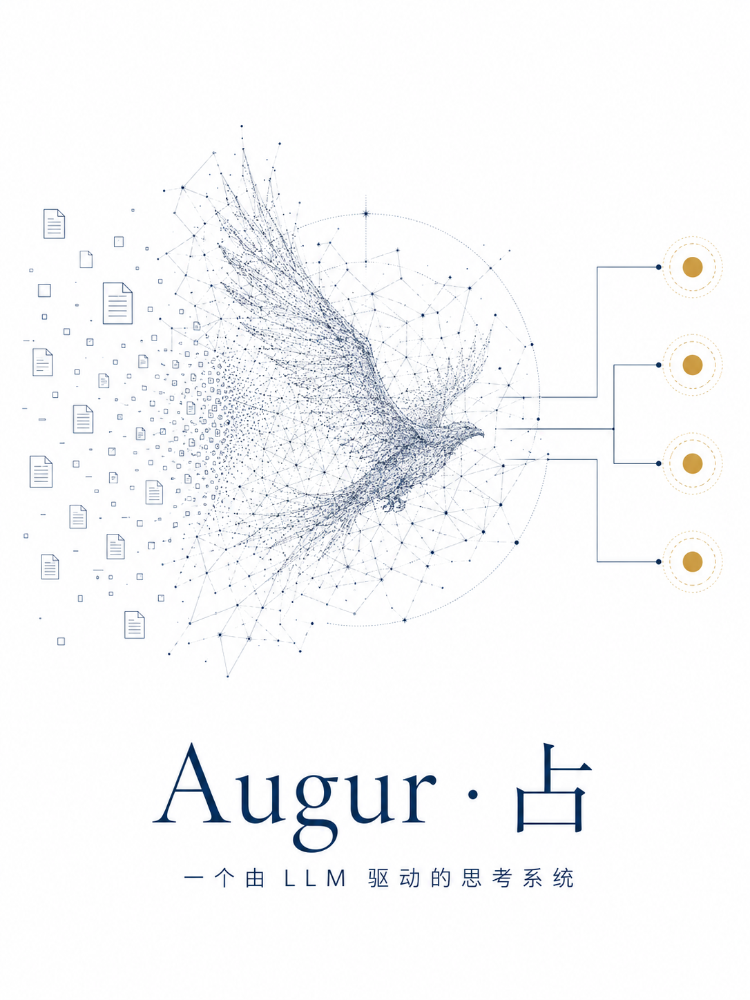
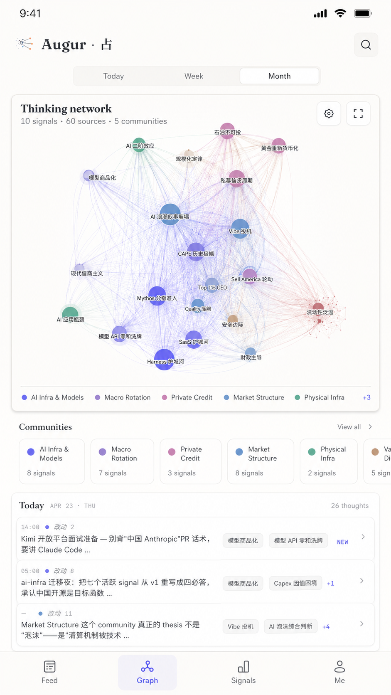
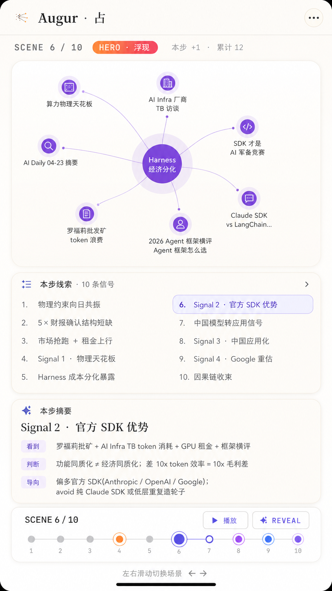

# Augur · 占

**A generative thinking surface for supervising how AI turns scattered context into replayable thought.**

When AI makes answers cheap, the scarce thing is no longer text. The scarce thing is the ability to see, steer, and preserve how thought is being organized.

Augur is an experiment in **Supervised Thinking**: a human-AI interface where the user expresses what they are thinking about, and the AI grows that loose intent into nodes, relations, forks, diaries, and replayable reasoning surfaces.

It is not a chatbot. It is not a traditional knowledge graph. It is not a raw chain-of-thought viewer.

It is closer to an **AI thinking sandbox**: a place where thinking can be unfolded, rearranged, branched, kept, challenged, and replayed.

<p align="center">
  
</p>

## 中文

### 核心哲学

Augur 的起点不是“让 AI 生成更多内容”，而是回答一个更底层的问题：

> 当 AI 可以无限输出信息时，人应该如何监督 AI 的思考组织方式？

用户只需要用自然语言表达自己正在想什么。AI 需要像一个真正热爱探究问题的人一样，独立阅读 source，发现反常、共识、矛盾和可继续追问的线索，然后把这些松散材料生长成一组可继续推进的思考节点。

Augur 的目标不是把复杂思考压缩成摘要，而是把思考摊开：

- 它读了什么 source
- 它为什么觉得某个细节有意思
- 它如何把几个 dots 串成 signal
- 它发现了哪些跨 source 的关系
- 它如何形成一个新的分支
- 它为什么保留、修正、提升或放弃某个节点
- 这一轮思考如何改变下一轮思考

这里的“思维日记”不是模型隐藏的原始 CoT，而是一个**外显、可审计、可升级的 reasoning diary**。Augur 关心的是人能不能看见 AI 的工作过程，而不是只读最终答案。

### 三层战略架构

#### 1. Interaction Layer / 交互层

Augur 首先是一种新的 AI 交互方式。

用户不是在编辑图，也不是在填 schema，而是在推动一块 thinking canvas 继续生长：

- **Continue**：沿着当前 focus 继续推进
- **Branch**：从一个节点分叉出新的探索方向
- **Fork**：把一条思路复制成独立 sandbox，允许另一套假设生长
- **Keep**：保留一个值得跨 session 记住的节点
- **Reframe**：让 AI 重新组织当前思考表面

未来的核心动作不是“搜索答案”，而是“和 AI 一起管理思考状态”。

#### 2. Node-First Substrate / 节点化思维底座

Augur 的第一性原理是：**所有可保留的思考痕迹都可以成为 node。**

一个 node 可以是：

- source：AI 对一份原始材料的结构化观察
- signal：跨 source 发现的有趣共识、矛盾或趋势
- question：还没有答案但值得继续追问的问题
- diary step：一次思考中明确的推导步骤
- fork：从当前思路分出去的平行沙箱
- community：比 signal 更高一层的主题结构
- contradiction：迫使系统重新判断的张力
- pinned insight：用户明确要保留的想法

Source 和 signal 是当前实现里的关键 typed nodes，但它们不是全部世界。Augur 更大的目标是一个 node-first reasoning substrate：关系可以由 AI 生成，分组可以由 AI 生成，局部界面也可以由 AI 生成；底层只要求 provenance、delta、causal chain 和可回放性。

#### 3. Projection Layer / 投影层

当前的 Augur UI 是这个 substrate 的第一套 projection。

同一组思考状态未来可以被投影成：

- graph network
- thought feed
- mobile cards
- replay timeline
- sandbox scene
- research memo
- decision table
- fork comparison

这也是为什么 Augur 不应该被理解成“图数据库前端”。Graph 只是一个视图。真正的产品是：AI 生成结构化 thinking state，UI 把它投影成可检查、可交互、可回放的界面。

### Source、Signal、Community 的关系

当前 prototype 保留 source / signal，因为它们是从 raw information 走向 judgment 的最小路径。

- **Source**：AI 独立读一份材料后写出的观察节点。它需要说明看到什么、为什么有意思、和哪个问题有关。
- **Signal**：跨多个 source 后浮现出来的发现。它不是摘要，而是“这些 dots 串起来之后出现了什么新东西”。
- **Community**：高于 signal 的主题结构。它不是 signal 的别名，而是多个 signal 逐渐聚合出来的上层问题空间。

换句话说：

```text
raw material -> source nodes -> signal nodes -> communities / forks / replayable reasoning state
```

### 为什么叫 Augur

Augur 的名字来自古代星图占卜：从分散的迹象中读出结构。

在这个项目里，迹象不是星星，而是 source material、AI observations、semantic proximity、signals、contradictions、forks 和跨 session 的 thought deltas。

Augur 是一台可回放的思考机器。它试图让 AI 的输出从一次性文本，变成一个可被人监督的、持续生长的思考表面。

### 为什么不是普通 Graph

Obsidian graph 和常见 graphify 方案通常解决的是导航问题：文件之间有没有链接，节点之间有没有边。

Augur 关心的不是“图好不好看”，而是：

- 这个节点为什么存在
- 它来自哪个 source
- 它驱动了哪个 signal
- 它和哪些节点形成张力
- 它在这次 run 中如何改变了思考状态
- 它是否应该被 keep、branch、fork 或 archive

所以 Augur 的 graph 不是文件拓扑，而是 reasoning state 的 projection。

### 产品截图

#### Brand System

<p align="center">
  
</p>

#### Thinking Network

<p align="center">
  
</p>

主界面把 source、signal、community 和 reasoning relation 放在同一个 thinking surface 中。右侧是当前状态的索引，左侧是跨 session 的 thought feed 和 run diary。

#### Mobile Thinking Network

<p align="center">
  
</p>

移动端不是把桌面图简单压缩，而是把 graph、community、feed 和 signal index 重排成可扫读的信息流。目标是在小屏上仍然保留信息密度，而不是退化成摘要卡片。

#### Sandbox / Replay Mode

<p align="center">
  
</p>

Sandbox 用于围绕一个 focus 跑独立 thinking run。Fork 则允许一个思路从主线分离出来，在自己的假设空间里继续生长。

#### Mobile Replay Scene

<p align="center">
  
</p>

Replay scene 把一次推导拆成可滑动的 scene：本步读了什么、发现了什么、连接了什么、导向什么、如何改变下一步。它是 Augur 最核心的产品方向之一：把跨 session 的 thought trail 变成用户可以检查、暂停、质疑和重放的界面。

### 当前实现边界

这个仓库是 Augur 的早期 reference projection。

当前已包含：

- Augur graph UI shell
- source / signal / community 的 typed node prototype
- run log 与外显 thinking diary 的 schema 方向
- embedding semantic layout 的实验路径
- static `data.js` snapshot 的前端读取方式，live state API 仍在 roadmap 中
- sandbox、timeline、mobile replay 的产品设计素材

当前还不是完整产品：

- AI generative UI 仍处在 scene/state JSON 方向的早期阶段
- fork runtime 还没有产品化
- public demo dataset 仍需整理
- 私有 raw data、真实研究结果、生成 graph data 不会公开

### 上交边界

我会把“系统能力”上交，而不是把“私人知识库”上交。

应该放进 GitHub：

- 产品截图和品牌图
- UI source code
- schema 设计
- agent skill / execution protocol
- live state / data contract 的实验代码
- 技术架构和未来路线

不应该放进 GitHub：

- 原始研报、访谈、PDF
- 私有 source / signal / workspace
- 生成的真实 graph data
- token、cookie、MCP 配置
- 还没清理的实验草稿

## English

### What Is Augur

Augur is a **generative thinking surface** for Supervised Thinking.

The core thesis is simple: as AI makes information output cheap, the next interface should not only ask for more answers. It should help humans supervise how AI organizes thought.

In Augur, the user expresses what they are thinking about. The AI reads source material, creates nodes, discovers cross-source signals, writes an externalized reasoning diary, and updates a replayable thinking state. The UI then projects that state as a graph, feed, timeline, replay scene, or future generative surface.

### The Product Direction

Augur is not:

- a chatbot
- a traditional knowledge graph
- a RAG wrapper
- a raw hidden CoT visualizer
- an investment-only research tool

Augur is an early attempt at a **node-first reasoning substrate**.

Every durable trace of thought can become a node: a source observation, signal, question, diary step, contradiction, fork, community, or pinned insight. Relationships do not have to be hard-coded in advance. The AI can generate them as the thinking surface grows, while the system preserves provenance, deltas, and replayability.

### Three-Layer Architecture

1. **Interaction Layer**
   The human works in natural language: continue, branch, fork, keep, reframe. The interaction is not manual graph editing; it is steering a live thinking state.

2. **Node-First Substrate**
   Source and signal are important typed nodes, but the deeper primitive is the node itself. Nodes preserve origin, context, relation, and change over time.

3. **Projection Layer**
   Graph, feed, mobile card, replay timeline, memo, and fork comparison are all projections of the same underlying thinking state.

This separation matters because the long-term product is not a prettier graph. It is a reusable substrate for human-AI co-thinking.

### Source, Signal, Community

The current prototype uses a source-to-signal path because it is the smallest useful bridge from raw material to judgment.

- **Source**: a structured observation created after the AI reads one piece of raw material.
- **Signal**: a cross-source discovery that connects multiple observations into something worth tracking.
- **Community**: a higher-level theme that groups multiple signals into a broader problem space.

The intended flow is:

```text
raw material -> source nodes -> signal nodes -> communities / forks / replayable reasoning state
```

### Why This Matters

Most AI interfaces expose the final answer. For serious knowledge work, that is too thin.

The important questions are:

- What did the model read?
- What did it find interesting?
- What did it connect?
- What changed its direction?
- Which contradictions should a human inspect?
- Which insight should survive across sessions?

Augur makes those questions visible.

### Implementation Notes

The public repository includes the framework, schema direction, UI shell, screenshots, and architecture notes. It intentionally excludes private research data and generated graph state.

The current implementation is an early reference projection. The longer-term direction is to let AI emit structured scene/state JSON while a stable renderer turns that state into graph, feed, timeline, mobile replay, or other views.

For implementation details, see:

- [Technical Architecture](docs/ARCHITECTURE.md)
- [Roadmap](docs/ROADMAP.md)

### Local Preview

The public repo includes the Augur UI source. Private generated graph data is excluded.

When local graph data is present:

```bash
cd investor-wiki/wiki
python3 -m http.server 8769 --bind 127.0.0.1
```

Open:

```text
http://127.0.0.1:8769/augur/index.html
```
